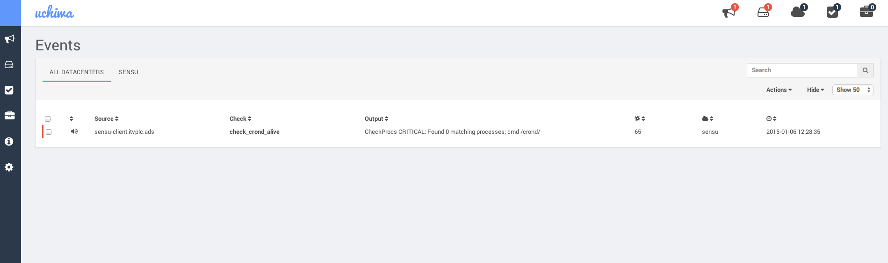

# Vagrant Sensu (Sandbox)

Ready to go Sensu client/server VMs (Centos 6.5) with all dependencies.

Sensu is pinned to version: `0.16.0-1`.
Uchiwa (Sensu GUI) is pinned to version: `0.4.0-1`.

## Pre-requisites

You'll need the following installed on your system. The versions are provided in parentheses for info but there shouldn't be any problems with earlier versions of things.

- Vagrant (`1.6.3` confirmed working)
- VirtualBox (`4.3.20` confirmed working)
- Ruby (`2.1.0` confirmed working, `1.9.3` onwards should be fine)
- Bundler (`1.5.2` confirmed working)

## Installation

Install the required gems:

```bash
$ bundle install
```

Install the required Puppet modules:

```bash
$ librarian-puppet install
```

Bring up the VMs:

```bash
$ vagrant up
```

## Usage

Once the 2 VMs are up and running, navigate to the [Uchiwa dashboard (Sensu GUI)](http://33.33.33.90:3000/).

To test that alerts are working, bring down `crond` on the client VM.

```bash
$ vagrant ssh client
...
$ sudo service crond stop
Stopping crond:                                            [  OK  ]
```


